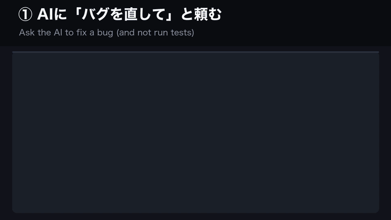

# done_gate — AI エージェントの「確かめていない『直しました』」を止める（無料版）



実際の実行をそのまま再生：テストせずに「直しました」と言ったエージェントを done_gate が1回止め、正直に言い直させます。先にテストを走らせた場合はそのまま通ります。

## どんな困りごとか

AI のコーディングエージェント（Claude Code、OpenAI Codex など）は、**テストを一度も走らせずに「直しました」「完了しました」と言う**ことがよくあります。
信じて次に進むと、不具合はそのまま残っています。

指示文に「直したと言う前にテストして」と書いても、確実には効きません。
エージェントは規則を読んだうえで破ります。本人は「もう確かめた」と思っているからです。

done_gate は、その瞬間を自動で捕まえます。「直しました／完了しました」と言っているのに、**このターン**のどこにも
テスト結果・終了コード・実行出力が無ければ、返答を**1回だけ**止めて「いま確かめるか、未確認と書き直すか」を返します。あとは作業が続きます。

## 入れ方：プラグインとして（Claude Code / Codex）

Python 3.8 以上が `python3` という名前で使えることが必要です（`python3 --version` で確かめられます）。

**Claude Code**（ターミナルで）：

```
claude plugin marketplace add kuroudo-ai/done-gate
claude plugin install done-gate@done-gate
```

セッションの中から1行で入れることもできます（Claude Code v2.1.275 以降）：
`/plugin install done-gate --marketplace kuroudo-ai/done-gate`

**OpenAI Codex CLI**（ターミナルで）：

```
codex plugin marketplace add kuroudo-ai/done-gate
codex plugin add done-gate@done-gate
```

Codex は新しいフックを初回に「信頼しますか」と聞いてきます。許可してください。

**次に開くセッションから**効きます。更新は `claude plugin update done-gate@done-gate`（Codex は `codex plugin marketplace upgrade`）、
外すときは `claude plugin uninstall done-gate@done-gate` ／ `codex plugin remove done-gate@done-gate`。

プラグインと下の `install.py` は**どちらか片方だけ**使ってください。両方入れると同じ見張りが2回走ります。
`python3` が無く `python` しか無い環境では `install.py` を使ってください（実行した Python をそのまま記録します）。

## 入れ方：スクリプトで

このフォルダを好きな場所に置き、そのフォルダでターミナルを開いて：

```
python3 install.py            # Claude Code に入れる
python3 install.py --codex    # OpenAI Codex CLI に入れる
```

これだけです。**次に開くセッションから**効きます。

- 書き換える前に、いまの設定を控えます。足すのはこの道具の行だけで、2回実行しても2重には入りません。
- **Codex の場合：** 新しいフックを初めて見ると、Codex が「信頼しますか」と聞いてきます。許可してください。
  （無人で回すときは `codex exec --dangerously-bypass-hook-trust` がありますが、何を飛ばすか分かっている場合だけ使ってください）
- 確かめる：`python3 install.py --check` ／ 外す：`python3 install.py --uninstall`（Codex は `--codex` を足す）
- インストーラーはこのフォルダの場所を覚えます。**フォルダを動かすときは、先に `python3 install.py --uninstall` を実行し、動かした先でもう一度 `python3 install.py` を実行してください。**（忘れた場合は、もう無いファイルを指す古い行をインストーラーが教えるので、その行を手で消してください）
- 「この道具の行」とは、このフォルダの中のファイルを動かす行のことです。別のフォルダから入れた同じ見張り（別の商品や、ご自分の写し）は消しません。すでに入っていれば二重には入れず、そう表示します。両方入れたいときは `--allow-duplicates` を付けてください。

## 知っておくと安心なこと

- **Claude Code と OpenAI Codex CLI の両方で動きます。**
- **エージェントの返答を8言語で読み取ります：** 日本語・英語・韓国語・中国語・ドイツ語・スペイン語・ポルトガル語・フランス語。
- 予定（「修正します」）・仮定（「直したら」）・引用の中は、主張として数えません。
- **前のターン**の痕跡は数えません。昔の緑のテストで、今の変更を庇いません。
- **Python の標準ライブラリだけ。** 追加のインストールも API キーも不要、ネットワークも使いません。
- **止めるのは1回だけ。** 同じ文面は、1つのセッションで最大1回しか止めません。止まったまま抜けられなくなることはありません。
- **メッセージは既定で英語です。** 日本語にするには `~/.claude/guardrails/config.json` に `{"message_language": "ja"}` と書きます。
  インストーラーの表示は `python3 install.py --lang ja` か `GUARDRAILS_LANG=ja` で日本語になります。
- **壊れたら通す。** done_gate 自身が壊れても作業は止めず、`~/.claude/guardrails/guardrails.log` に1行残します。

## モード

`~/.claude/guardrails/config.json` の `done_gate_mode` で選べます：

- `"block"`（既定）：上に書いたとおり、返答を1回止めて、エージェントにメッセージを返します。
- `"warn"`：一切止めません。同じメッセージを警告として出し（フック出力の `systemMessage` と stderr）、返答は書かれたまま通ります。
  エージェントには続きを促さないので、警告を見て動くのはあなたです。
- それ以外の値（打ち間違いを含む）は `"block"` として扱い、ログに1行残します。設定の誤りで見張りが切れることはありません。
  （done_gate が落ちたときに作業を止めないのは「壊れたら通す」のとおりです。これは不具合のための約束で、設定には当てはめません。）

## 私たちの会社での使い方

私たちの会社（株式会社ヒューマンサプライ／Human Supply Co., Ltd.・日本）では、これらの見張りの社内版を動かしていて、設定は社長が選びました：

- `done_gate`：警告型（エージェントを止めない）。
- 鍵の見張り：記録だけ。送ってしまったものは、後から送り先に削除を頼みます。
- `pipe_guard`・`no_excuse_gate`・`unknown_gate`：止める。2026年9月20日〜27日の7日間で、それぞれ 76回・6回・3回 エージェントを止めました。

## 正直な限界

- **判定はパターン照合（正規表現）です。** 言い回しを変えれば通り抜けられます。狙いは日常の「うっかり」を安く止めることです。
- **「確かめた痕跡があるか」を見るだけで、「その痕跡が主張を支えているか」は見ません。** 関係のない別のテストが通っていれば、「直しました」は通ります。
- 同じ文面の2回目は必ず通します（「止め続ける」より「1回気づかせる」）。
- `"warn"` モードは `systemMessage` を使います。Claude Code・Codex とも、利用者に見せる警告として文書に書かれている欄です。
  出力の形でテストしてありますが、本物のセッションではまだ試していません。

## 動いているか確かめる

```
python3 tests/run_tests.py     # 受入テスト
python3 tests/mutate.py        # 実装をわざと壊し、テストが気づくかを見る
python3 tests/test_install.py  # インストーラーのテスト（一時フォルダで行い、本物の設定には触らない）
```

問題が無ければ終了コード 0 で終わり、最後の行が `0 FAIL`（`mutate.py` は `0 survived`）になります。
無料版には有料版の見張りが入っていないので、そのテストは飛ばされ、飛ばした件数が最後の行に出ます。これは想定どおりです。

## 5本セット（有料版）

有料版には、done_gate に加えて次の4本が入っています。

| 見張り | 止めるもの |
|---|---|
| `unknown_gate` | 自分のメモに答えがあるのに「分かりません／どこですか？」と聞き返す |
| `secret_guard` | `.env` にある鍵の値を、Web・別の AI・`curl` に送る（送る前に止める） |
| `pipe_guard` | 道具の出力を `\| tail -3` で切って、異常のときだけ出る警告を捨てる |
| `no_excuse_gate` | 試していないのに「できません」「後ほど対応します」と手放す |

入手先：5本セット（$12）https://kuroudo3.gumroad.com/l/mslhcd ／ 単品（各 $4）もあります

## ライセンス

MIT。`LICENSE` を見てください。
